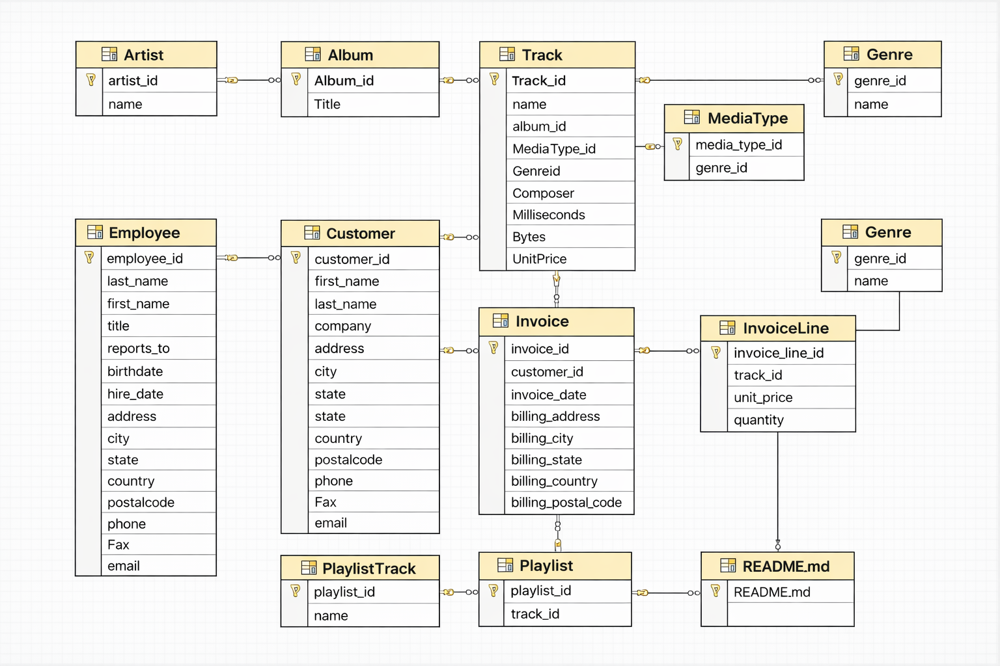

# SQL-Music-Store-Data-Analysis
# Online Music Store Database Analysis

##  Project Overview  
This project is based on an **Online Music Store Database** designed to analyze customer behavior, sales trends, and music preferences.  
It involves working with a relational database containing multiple interconnected tables such as customers, invoices, tracks, artists, and playlists.

The goal of this project is to **extract meaningful business insights using SQL queries**.

---

## Database Schema  

The database consists of the following tables:

- **Artist** – Stores artist details  
- **Album** – Contains albums linked to artists  
- **Track** – Includes song-level data  
- **Genre** – Music categories  
- **MediaType** – Format of tracks  
- **Playlist & PlaylistTrack** – Playlist management  
- **Customer** – Customer information  
- **Employee** – Sales/support representatives  
- **Invoice & InvoiceLine** – Sales transactions  

---

##  Tech Stack  

- **SQL Server**
- **DBMS Concepts**
- **Data Analysis using SQL**

---

##  Key Analysis Performed  

-  Identify top-selling tracks and artists  
-  Analyze revenue generated by country/city  
-  Understand customer purchase behavior  
-  Find most popular genres and playlists  
-  Invoice-based sales analysis  
-  Revenue trends over time  

---

##  Sample Business Questions Solved  

- Who is the **top spending customer**?  
- Which **country generates the highest revenue**?  
- What are the **top 10 most popular tracks**?  
- Which **genre is most preferred by customers**?  
- Who are the **best performing employees**?  

---

##  How to Use  

1. Import the SQL file into your database  
2. Load all CSV files into respective tables  
3. Run SQL queries for analysis  

---

##  Key Skills Demonstrated  

- SQL Joins (INNER, LEFT, RIGHT)  
- Aggregations (SUM, COUNT, AVG)  
- Subqueries & CTEs  
- Window Functions 
- Data Cleaning & Transformation  
- Business Insight Generation  

---

##  Project Outcome  

This project demonstrates the ability to:  
- Work with **real-world relational databases**  
- Perform **data-driven analysis using SQL**  
- Convert raw data into **actionable insights**  

---

##  Contact  

**Raju Kumar Sahu**  
   rk.sahu.contact@gmail.com  
   GitHub: https://github.com/kumarrajusahu  
   LinkedIn: https://www.linkedin.com/in/raju-kumar-sahu-data-analyst/  

---

##  If you found this project useful, don’t forget to star the repo!
